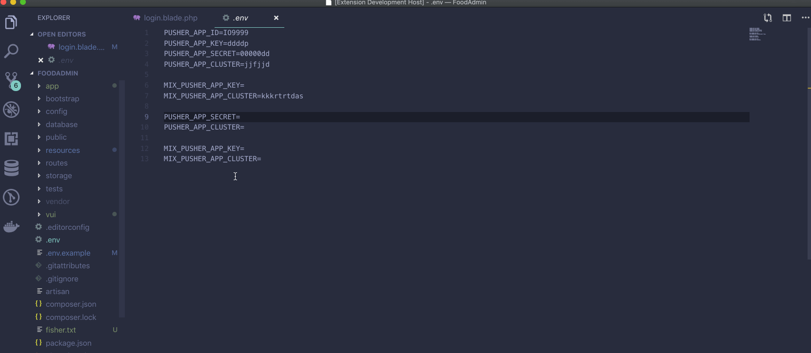
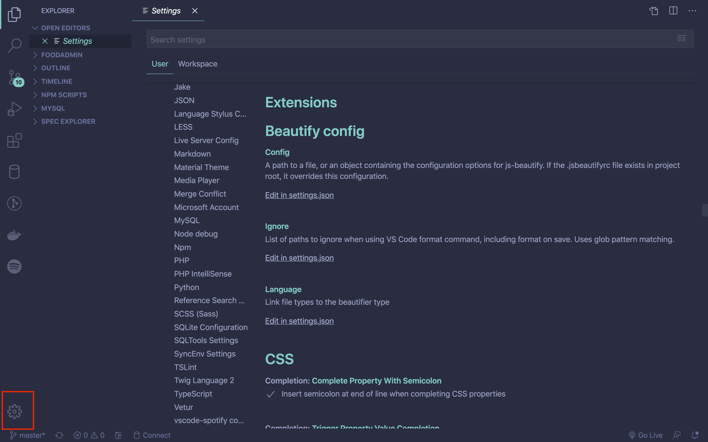
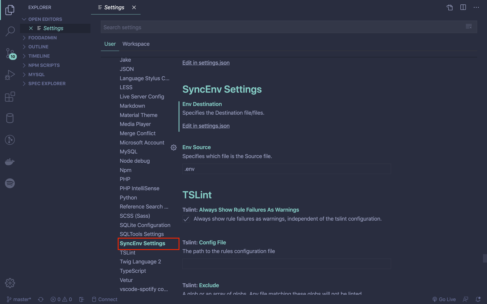
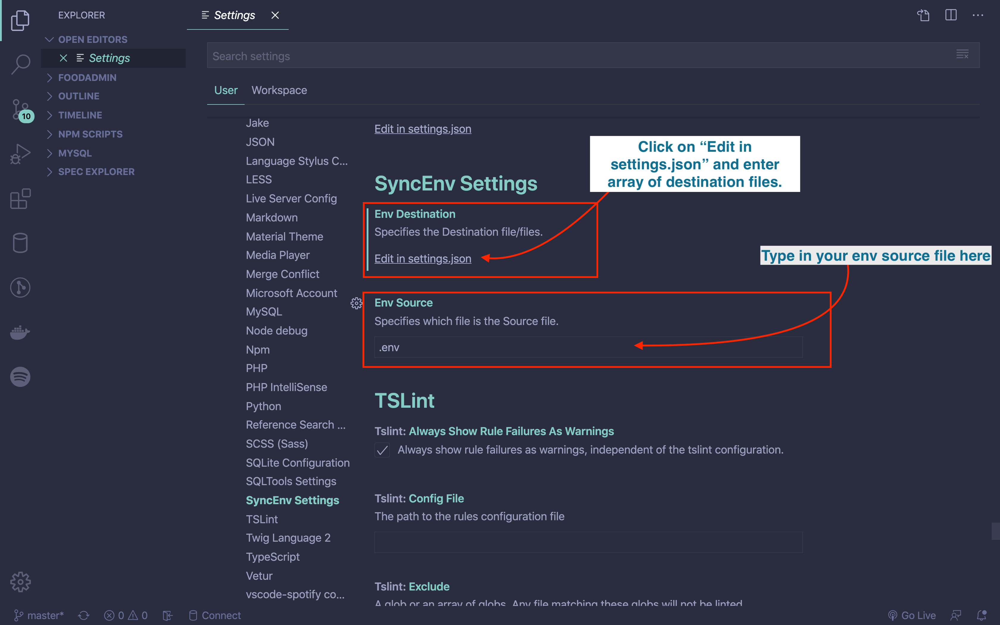
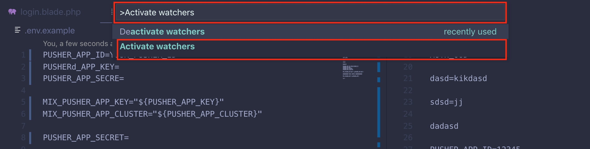
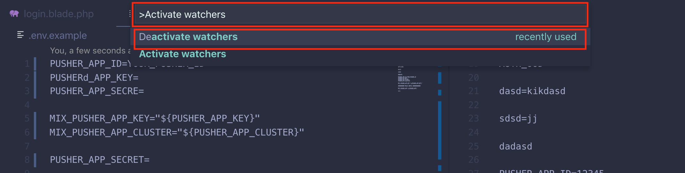

# sync-env

This is the README for ["sync-env"](https://marketplace.visualstudio.com/items?itemName=dongido.sync-env) which helps you keep your env files in sync. Once you have installed the `sync-env` extension, it will begin synchronizing any source env file and destination env file/files found in your project root folder. It also works with sub folders too.

Annnnd if you like it, consider suppporting me at [Pateron](https://www.patreon.com/dongido)

## Installing

Download and install it from the vs-code market [here](https://marketplace.visualstudio.com/items?itemName=dongido.sync-env)

## Configuring sync files

The extension assumes that your config files are `.env`(source) and `.env.example`(destination) by dfault. Sure, this is not the case most of the time. You can specify which file is your source file and which is the destination file.

To configure:

1. Click on the settings Icon:

2. Then click on **SyncEnv Settings**:

3. Finally, set your files as you wish:

> **Note** that the `Env Destination` can be a string or an array. Example: ".env.local" 
> OR 
> `[
    ".env.example",
    ".env.local",
    ".env.development"
]`

> **Note** that the `Env Source` is just be a string. Example of input is: `.env.development`

## Activating and Deactivating

The extension is activated automatically by default when it is first installed. In case you have deactivated it before, you can activate it using by:

1. Shift + Command + P
2. Type into the command pallet - `Activate Watchers` to bring out the command, then click on it.

To deactivate the extension:

1. Shift + Command + P
2. Type into the command pallet - `Deactivate Watchers` to bring out the command, then click on it to deactivate the extension.

# CHANGELOG

Notable changes:

## [1.0.3] - 2019-04-10

### Added
- Added basics for writing tests
- Provided provision for customising .env files
- Prompt to copy content of watched files for created config file.
### Changed
- Refactored code
### Removed

## [1.0.4] - 2019-09-27

### Added
- Added extension activation command
- Added extension deactivation command
- [Env variable](https://github.com/dongido001/vscode-sync-env/issues/3) can now be synced!
- [Comments](https://github.com/dongido001/vscode-sync-env/issues/2) are now respected - 
### Changed
- Refactored code to allow activating and deactivating the extension
### Removed

## [1.0.5] - 2020-05-25

### Added
- You can now customize/specify your env files
### Changed
### Removed

## BUG AND FEATURE REQUEST
Please, open an [issue on GitHub](https://github.com/dongido001/vscode-sync-env/issues) if you want to report a bug or you thought of a good feature to have. 

Contribution is always wellcomed!

## TODO

- [x] Allow users to set the files they want to sync.

- [] ...And other requested features
